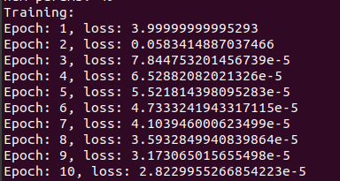

# micrograd_rs

 

A Rust Beginner's implementation of [Andrej karpathy's micrograd](https://github.com/karpathy/micrograd).  
Here's [Link](https://www.youtube.com/watch?v=VMj-3S1tku0) to the YouTube video.  
Also thanks to [micrograd-rust](https://github.com/sloganking/micrograd-rust) for reference implementation in rust.
 

## The current implementation is limited to: 
============================================== 
* scalar valued autograd
* Implementation of forward and backward pass for arithmetic operations and power operation.
* Implementation of forward and backward pass for activation functions - tanh and relu.
 

## Sample Output:  
=============================================== 

 

## TO-DO:
==========================================
* graph visulization using libraries like [graphviz](https://graphviz.org/download/)
* Implementation of Tensor type library from scratch
* Improve implementation of MLP, activations etc for Tensors.

